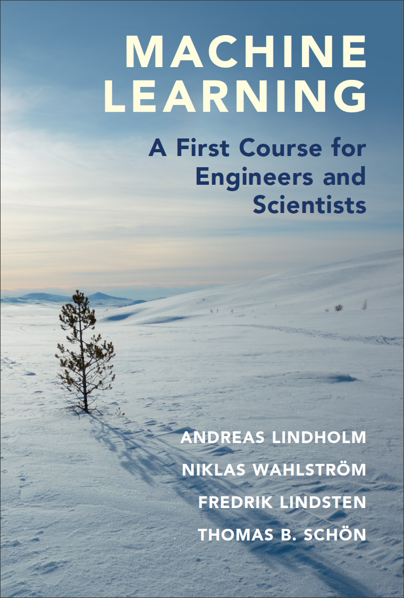

When we developed the course [Statistical Machine Learning](http://www.it.uu.se/edu/course/homepage/sml/) for engineering students at Uppsala University, we found no appropriate textbook, so we ended up writing our own. It will be published by [Cambridge University Press](https://www.cambridge.org/highereducation/books/machine-learning/30AC30764CCF1ACBF86188BECD1B00AE) in 2022.

Andreas Lindholm,
[Niklas Wahlström](https://www.it.uu.se/katalog/nikwa778/),
[Fredrik Lindsten](https://liu.se/medarbetare/freli29), and
[Thomas B. Schön](http://user.it.uu.se/~thosc112/) 

A draft of the book is available below. **We will keep a PDF of the book freely available also after its publication.**

[**Latest draft of the book**](book/sml-book-draft-latest.pdf) ([older versions &gt;&gt;](https://github.com/uu-sml/sml-book-page/commits/master/book))

_We continuously receive valuable feedback from our readers that we attempt to process. However, the manuscript is right now also being processed by the publisher. Unless any serious errors are found, we will await the publishing process before we release an updated version here._

## Table of Contents

1. **Introduction**
   - The machine learning problem
   - Machine learning concepts via examples
   - About this book   
2. **Supervised machine learning: a first approach**
   - Supervised machine learning
   - A distance-based method: k-NN
   - A rule-based method: Decision trees
3. **Basic parametric models for regression and classification**
   - Linear regression
   - Classification and logistic regression
   - Polynomial regression and regularization
   - Generalized linear models
4. **Understanding, evaluating and improving the performance**
   - Expected new data error: performance in production
   - Estimating the expected new data error
   - The training error–generalization gap decomposition
   - The bias-variance decomposition
   - Additional tools for evaluating binary classifiers
5. **Learning parametric models**
   - Principles pf parametric modelling
   - Loss functions and likelihood-based models
   - Regularization   
   - Parameter optimization
   - Optimization with large datasets
   - Hyperparameter optimization
6. **Neural networks and deep learning**
   - The neural network model
   - Training a neural network   
   - Convolutional neural networks
   - Dropout
7. **Ensemble methods: Bagging and boosting**
   - Bagging
   - Random forests
   - Boosting and AdaBoost
   - Gradient boosting
8. **Nonlinear input transformations and kernels**
   - Creating features by nonlinear input transformations
   - Kernel ridge regdression
   - Support vector regression
   - Kernel theory
   - Support vector classification
9. **The Bayesian approach and Gaussian processes** 
   - The Bayesian idea
   - Bayesian linear regression
   - The Gaussian process [**Online material: Gaussian process visualization**](GP/index.html)
   - Practial aspects of the Gaussian process
   - Other Bayesian methods in machine learning
10. **Generative models and learning from unlabeled data**
    - The Gaussian mixture model and discriminant analysis
    - Cluster analysis
    - Deep generative models
    - Representation learning and dimensionality reduction
11. **User aspects of machine learning**
    - Defining the machine learning problem
    - Improving a machine learning model
    - What if we cannot collect more data?
    - Practical data issues
    - Can I trust my machine learning model?
12. **Ethics in machine learning** (by [David Sumpter](https://katalog.uu.se/empinfo/?id=N7-525))
    - Fairness and error functions
    - Misleading claims about performance
    - Limitations of training data

## Some reviews

_"An authoritative treatment of modern machine learning, covering a broad range of topics, for readers who want to use and understand machine learning." **Bernhard Schölkopf, Max Planck Institute for Intelligent Systems**_

_"This book provides the perfect introduction to modern machine learning, with an ideal balance between mathematical depth and breadth. Its outstanding clarity and many illustrations make it a perfect tool for self-learning or as a textbook for an introductory machine learning class." **Francis Bach, Inria Ecole Normale Supérieure**_

_"Lucid and engaging, this book is a brilliant companion to anyone with a numerate background who wants to know what really goes on under the hood in supervised learning. The core theory and rich illustrative examples enable practitioners navigate the jungle of modern machine learning." **Carl Edward Rasmussen, University of Cambridge**_

_"This book provides an excellent introduction to machine learning for engineers and scientists. It covers the main techniques in this exciting area ranging from basic approaches, such as linear regression and principal component analysis, to modern deep learning and generative modelling techniques. The authors have managed to find the right balance between academic rigor, intuition and applications. Required reading for any newcomer interested in this field!" **Arnaud Doucet, University of Oxford**_

_"This book strikes a very good balance between accessibility and rigour. It will be a very good companion for the mathematically trained who want to understand the hows and whats of machine learning." **Ole Winther, University of Copenhagen and Technical University of Denmark**_

**If you want to cite the book,** you can cite it as


@book{smlbook,
   author = {Lindholm, Andreas and Wahlstr\"om, Niklas and Lindsten, Fredrik and Sch\"on, Thomas B.},
   year = 2022,
   title = {Machine Learning - A First Course for Engineers and Scientists},
   publisher = {Cambridge University Press}
   URL={https://smlbook.org},
}


## Exercise material

Will eventually be added to this page. Meanwhile you may have a look at the material for our [course at Uppsala University](https://github.com/uu-sml/course-sml-public).

## Report mistakes and give feedback
Please report any mistakes or feedback [using the gitHub issue tracker](https://github.com/uu-sml/sml-book-page/issues) (A free GitHub account is required)
We appreciate all help in improving the text!
