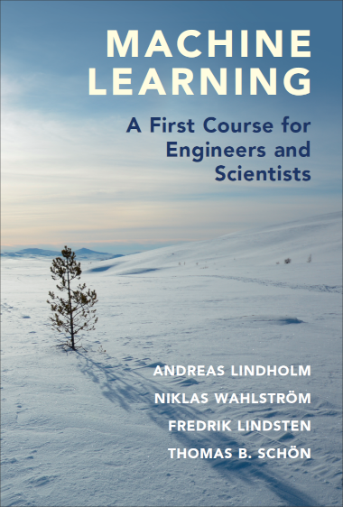

When we developed the course [Statistical Machine Learning](http://www.it.uu.se/edu/course/homepage/sml/) for engineering students at Uppsala University, we found no appropriate textbook, so we ended up writing our own. It was published by Cambridge University Press in 2022, and you can [order printed books from them](https://www.cambridge.org/highereducation/books/machine-learning/30AC30764CCF1ACBF86188BECD1B00AE) or through most bookstores.

**We are currently working on a 2nd edition and appreciate all feedback we receive!**

Andreas Lindholm,
[Niklas Wahlström](https://www.it.uu.se/katalog/nikwa778/),
[Fredrik Lindsten](https://liu.se/medarbetare/freli29), and
[Thomas B. Schön](http://user.it.uu.se/~thosc112/) 

PDF drafts of the book are available here:
- NEW! [**Latest draft of 2nd edition** (not yet in print; chapter 14 is work in progress)](book/sml-book-2nd-edition-draft-latest.pdf)
- [**Draft of the 1st edition**](book/sml-book-draft-latest.pdf) ([older versions &gt;&gt;](https://github.com/uu-sml/sml-book-page/commits/master/book))

## Table of Contents in 2nd edition

1. **Introduction**
   - Machine Learning Exemplified
   - About this book   
2. **Supervised machine learning: a first approach**
   - Supervised machine learning
   - A distance-based method: k-NN
   - A rule-based method: Decision trees
   - Self-supervised learning
3. **Basic parametric models for regression and classification**
   - Linear regression
   - Classification and logistic regression
   - Polynomial regression and regularization
   - Generalized linear models
   - Generating outputs by sampling
4. **Understanding, evaluating and improving the performance**
   - Expected new data error: performance in production
   - Estimating the expected new data error
   - The training error–generalization gap decomposition
   - The bias-variance decomposition
   - Additional tools for evaluating binary classifiers
5. **Learning parametric models**
   - Principles pf parametric modelling
   - Loss functions and likelihood-based models
   - Regularisation   
   - Parameter optimisation
   - Optimisation with large datasets
   - Hyperparameter optimization
6. **Neural networks and deep learning**
   - The neural network model
   - Training a neural network
   - Going deeper: Nornmalisation and residual connections
   - Dropout
7. **Deep learning architectures: CNN and Transformers**
   - The building blocks for the convolutional neural network
   - The full convolutional neural network
   - Working with Text
   - The transformer architecture
   - Large language models
8. **Ensemble methods: Bagging and boosting**
   - Bagging
   - Random forests
   - Boosting and AdaBoost
   - Gradient boosting
9. **Nonlinear input transformations and kernels**
   - Creating features by nonlinear input transformations
   - Kernel ridge regdression
   - Support vector regression
   - Kernel theory
   - Support vector classification
10. **The Bayesian approach and Gaussian processes** 
   - The Bayesian idea
   - Bayesian linear regression
   - The Gaussian process [**Online material: Gaussian process visualization**](GP/index.html)
   - Practial aspects of the Gaussian process
   - Other Bayesian methods in machine learning
11. **Generative models**
    - Learning a generative model and using it for classification
    - Beyond supervised data: Semi-supervised learning
    - Cluster analysis
12. **Deep Generative Models and Representation Learning**
    - Deep generative modelling
    - Representation learning
    - Latent representations for dimensionality reduction: PCA
13. **User aspects of machine learning**
    - Defining the machine learning problem
    - Improving a machine learning model
    - What if we cannot collect more data?
    - Practical data issues
    - Can I trust my machine learning model?
    - Foundation models
14. **Ethics in machine learning** -- _work in progress_

## Some reviews of the 1st edition

_"An authoritative treatment of modern machine learning, covering a broad range of topics, for readers who want to use and understand machine learning." **Bernhard Schölkopf, Max Planck Institute for Intelligent Systems**_

_"This book provides the perfect introduction to modern machine learning, with an ideal balance between mathematical depth and breadth. Its outstanding clarity and many illustrations make it a perfect tool for self-learning or as a textbook for an introductory machine learning class." **Francis Bach, Inria Ecole Normale Supérieure**_

_"Lucid and engaging, this book is a brilliant companion to anyone with a numerate background who wants to know what really goes on under the hood in supervised learning. The core theory and rich illustrative examples enable practitioners navigate the jungle of modern machine learning." **Carl Edward Rasmussen, University of Cambridge**_

_"This book provides an excellent introduction to machine learning for engineers and scientists. It covers the main techniques in this exciting area ranging from basic approaches, such as linear regression and principal component analysis, to modern deep learning and generative modelling techniques. The authors have managed to find the right balance between academic rigor, intuition and applications. Required reading for any newcomer interested in this field!" **Arnaud Doucet, University of Oxford**_

_"This book strikes a very good balance between accessibility and rigour. It will be a very good companion for the mathematically trained who want to understand the hows and whats of machine learning." **Ole Winther, University of Copenhagen and Technical University of Denmark**_

_"First, the book is readable. There are some theoretical analyses or math equations. But authors will give the intuitions or figures to explain it. I really love the book. I hope in the next edition more topics are covered in the book. All illustrated figures are colorful." **kein_liao, Amazon buyer**_

**If you want to cite the book,** you can cite it as


@book{smlbook,
   author = {Lindholm, Andreas and Wahlstr\"om, Niklas and Lindsten, Fredrik and Sch\"on, Thomas B.},
   year = 2022,
   title = {Machine Learning - A First Course for Engineers and Scientists},
   publisher = {Cambridge University Press},
   URL={https://smlbook.org},
}


## Exercise material

Will eventually be added to this page. Meanwhile you may have a look at the material for our [course at Uppsala University](https://github.com/uu-sml/course-sml-public).

## Report mistakes and give feedback
Please report any mistakes or feedback [using the gitHub issue tracker](https://github.com/uu-sml/sml-book-page/issues) (A free GitHub account is required)
We appreciate all help in improving the text!
